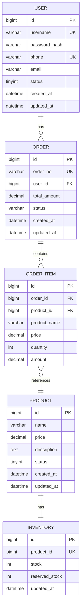

# 数据库设计

## 1. ER 图

### 1.1 实体关系概述



**关系说明：**
- User (1) —— (n) Order：一个用户可以有多个订单
- Order (1) —— (n) OrderItem：一个订单包含多个订单明细
- OrderItem (n) —— (1) Product：一个订单明细对应一个商品
- Product (1) —— (1) Inventory：一个商品对应一个库存记录

### 1.2 实体说明

| 实体 | 说明 | 主要职责 |
|------|------|----------|
| User | 用户 | 存储用户账号信息 |
| Product | 商品 | 存储商品基本信息 |
| Inventory | 库存 | 存储商品库存数据 |
| Order | 订单 | 存储订单主体信息 |
| OrderItem | 订单明细 | 存储订单中每个商品的购买信息 |

---

## 2. 表结构设计

### 2.1 用户表（user）

**表名：** `t_user`

**说明：** 存储用户账号信息

| 字段名 | 类型 | 约束 | 说明 |
|--------|------|------|------|
| id | BIGINT | PK, AUTO_INCREMENT | 主键 |
| username | VARCHAR(50) | UNIQUE, NOT NULL | 用户名 |
| password_hash | VARCHAR(255) | NOT NULL | 密码哈希值 |
| phone | VARCHAR(20) | UNIQUE | 手机号 |
| email | VARCHAR(100) | | 邮箱 |
| status | TINYINT | DEFAULT 1 | 状态（1:正常 0:禁用） |
| created_at | DATETIME | DEFAULT CURRENT_TIMESTAMP | 创建时间 |
| updated_at | DATETIME | DEFAULT CURRENT_TIMESTAMP ON UPDATE CURRENT_TIMESTAMP | 更新时间 |

**索引：**

```sql
UNIQUE INDEX idx_username (username)
UNIQUE INDEX idx_phone (phone)
INDEX idx_status (status)
```

---

### 2.2 商品表（product）

**表名：** `t_product`

**说明：** 存储商品基本信息

| 字段名 | 类型 | 约束 | 说明 |
|--------|------|------|------|
| id | BIGINT | PK, AUTO_INCREMENT | 主键 |
| name | VARCHAR(200) | NOT NULL | 商品名称 |
| price | DECIMAL(10,2) | NOT NULL | 价格 |
| description | TEXT | | 商品描述 |
| status | TINYINT | DEFAULT 1 | 状态（1:上架 0:下架） |
| created_at | DATETIME | DEFAULT CURRENT_TIMESTAMP | 创建时间 |
| updated_at | DATETIME | DEFAULT CURRENT_TIMESTAMP ON UPDATE CURRENT_TIMESTAMP | 更新时间 |

**索引：**

```sql
INDEX idx_status (status)
INDEX idx_name (name)
```

---

### 2.3 库存表（inventory）

**表名：** `t_inventory`

**说明：** 存储商品库存信息，与商品表一一对应

| 字段名 | 类型 | 约束 | 说明 |
|--------|------|------|------|
| id | BIGINT | PK, AUTO_INCREMENT | 主键 |
| product_id | BIGINT | UNIQUE, NOT NULL | 商品ID |
| stock | INT | DEFAULT 0 | 当前可售库存 |
| reserved_stock | INT | DEFAULT 0 | 预留库存（用于秒杀/预扣减） |
| updated_at | DATETIME | DEFAULT CURRENT_TIMESTAMP ON UPDATE CURRENT_TIMESTAMP | 更新时间 |

**索引：**

```sql
UNIQUE INDEX idx_product_id (product_id)
```

---

### 2.4 订单表（order）

**表名：** `t_order`

**说明：** 存储订单主体信息

| 字段名 | 类型 | 约束 | 说明 |
|--------|------|------|------|
| id | BIGINT | PK, AUTO_INCREMENT | 主键 |
| order_no | VARCHAR(64) | UNIQUE, NOT NULL | 业务单号 |
| user_id | BIGINT | NOT NULL | 用户ID |
| total_amount | DECIMAL(10,2) | NOT NULL | 订单总金额 |
| status | VARCHAR(20) | NOT NULL | 订单状态 |
| created_at | DATETIME | DEFAULT CURRENT_TIMESTAMP | 创建时间 |
| updated_at | DATETIME | DEFAULT CURRENT_TIMESTAMP ON UPDATE CURRENT_TIMESTAMP | 更新时间 |

**索引：**

```sql
UNIQUE INDEX idx_order_no (order_no)
INDEX idx_user_id (user_id)
INDEX idx_status (status)
INDEX idx_created_at (created_at)
```

**状态枚举：**

| 状态值 | 说明 |
|--------|------|
| PENDING_PAYMENT | 待支付 |
| PAID | 已支付 |
| CANCELLED | 已取消 |

---

### 2.5 订单明细表（order_item）

**表名：** `t_order_item`

**说明：** 存储订单中每个商品的购买信息

| 字段名 | 类型 | 约束 | 说明 |
|--------|------|------|------|
| id | BIGINT | PK, AUTO_INCREMENT | 主键 |
| order_id | BIGINT | NOT NULL | 订单ID |
| product_id | BIGINT | NOT NULL | 商品ID |
| product_name | VARCHAR(200) | NOT NULL | 商品名称（快照） |
| price | DECIMAL(10,2) | NOT NULL | 购买单价（快照） |
| quantity | INT | NOT NULL | 购买数量 |
| amount | DECIMAL(10,2) | NOT NULL | 小计金额 |

**索引：**

```sql
INDEX idx_order_id (order_id)
INDEX idx_product_id (product_id)
```

---

## 3. 建表 SQL

```sql
-- 用户表
CREATE TABLE t_user (
    id BIGINT PRIMARY KEY AUTO_INCREMENT,
    username VARCHAR(50) NOT NULL UNIQUE,
    password_hash VARCHAR(255) NOT NULL,
    phone VARCHAR(20) UNIQUE,
    email VARCHAR(100),
    status TINYINT DEFAULT 1 COMMENT '1:正常 0:禁用',
    created_at DATETIME DEFAULT CURRENT_TIMESTAMP,
    updated_at DATETIME DEFAULT CURRENT_TIMESTAMP ON UPDATE CURRENT_TIMESTAMP,
    INDEX idx_username (username),
    INDEX idx_phone (phone),
    INDEX idx_status (status)
) ENGINE=InnoDB DEFAULT CHARSET=utf8mb4 COMMENT='用户表';

-- 商品表
CREATE TABLE t_product (
    id BIGINT PRIMARY KEY AUTO_INCREMENT,
    name VARCHAR(200) NOT NULL,
    price DECIMAL(10,2) NOT NULL,
    description TEXT,
    status TINYINT DEFAULT 1 COMMENT '1:上架 0:下架',
    created_at DATETIME DEFAULT CURRENT_TIMESTAMP,
    updated_at DATETIME DEFAULT CURRENT_TIMESTAMP ON UPDATE CURRENT_TIMESTAMP,
    INDEX idx_status (status),
    INDEX idx_name (name)
) ENGINE=InnoDB DEFAULT CHARSET=utf8mb4 COMMENT='商品表';

-- 库存表
CREATE TABLE t_inventory (
    id BIGINT PRIMARY KEY AUTO_INCREMENT,
    product_id BIGINT NOT NULL UNIQUE,
    stock INT DEFAULT 0 COMMENT '可售库存',
    reserved_stock INT DEFAULT 0 COMMENT '预留库存',
    updated_at DATETIME DEFAULT CURRENT_TIMESTAMP ON UPDATE CURRENT_TIMESTAMP,
    UNIQUE INDEX idx_product_id (product_id)
) ENGINE=InnoDB DEFAULT CHARSET=utf8mb4 COMMENT='库存表';

-- 订单表
CREATE TABLE t_order (
    id BIGINT PRIMARY KEY AUTO_INCREMENT,
    order_no VARCHAR(64) NOT NULL UNIQUE,
    user_id BIGINT NOT NULL,
    total_amount DECIMAL(10,2) NOT NULL,
    status VARCHAR(20) NOT NULL COMMENT 'PENDING_PAYMENT:待支付 PAID:已支付 CANCELLED:已取消',
    created_at DATETIME DEFAULT CURRENT_TIMESTAMP,
    updated_at DATETIME DEFAULT CURRENT_TIMESTAMP ON UPDATE CURRENT_TIMESTAMP,
    UNIQUE INDEX idx_order_no (order_no),
    INDEX idx_user_id (user_id),
    INDEX idx_status (status),
    INDEX idx_created_at (created_at)
) ENGINE=InnoDB DEFAULT CHARSET=utf8mb4 COMMENT='订单表';

-- 订单明细表
CREATE TABLE t_order_item (
    id BIGINT PRIMARY KEY AUTO_INCREMENT,
    order_id BIGINT NOT NULL,
    product_id BIGINT NOT NULL,
    product_name VARCHAR(200) NOT NULL,
    price DECIMAL(10,2) NOT NULL,
    quantity INT NOT NULL,
    amount DECIMAL(10,2) NOT NULL,
    INDEX idx_order_id (order_id),
    INDEX idx_product_id (product_id)
) ENGINE=InnoDB DEFAULT CHARSET=utf8mb4 COMMENT='订单明细表';
```

---

## 4. 初始化数据

```sql
-- 插入测试商品
INSERT INTO t_product (name, price, description, status) VALUES
('iPhone 15', 5999.00, '苹果手机', 1),
('MacBook Pro', 12999.00, '苹果笔记本', 1),
('AirPods Pro', 1999.00, '苹果无线耳机', 1);

-- 插入对应库存
INSERT INTO t_inventory (product_id, stock) VALUES
(1, 100),
(2, 50),
(3, 200);
```

---

## 5. 读写分离说明

### 5.1 主从架构

- **主库（Master）**：负责所有写操作
  - 用户注册
  - 订单创建
  - 库存扣减/恢复
  - 商品管理

- **从库（Slave）**：负责读操作
  - 商品列表查询
  - 商品详情查询
  - 订单列表查询
  - 订单详情查询

### 5.2 数据源路由

应用层通过配置多数据源，实现读写分离：
- 写操作路由到主库
- 读操作路由到从库（如从库故障则退化到主库）
